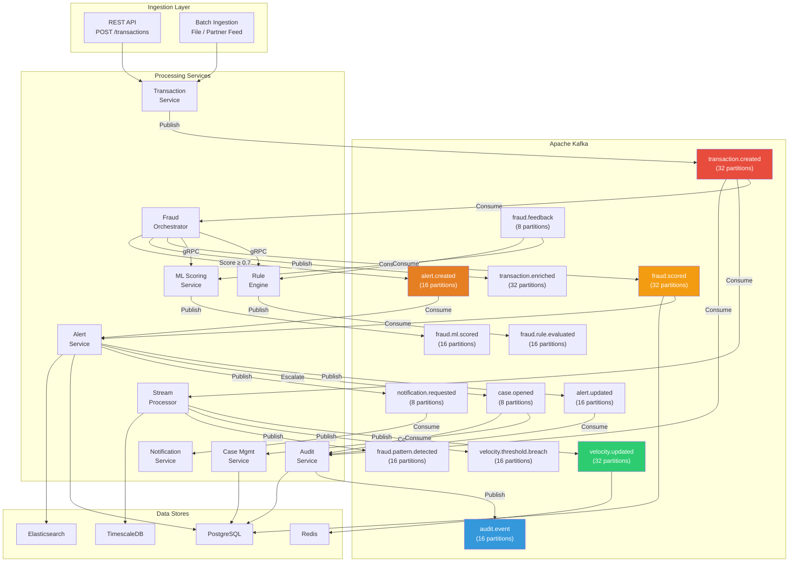
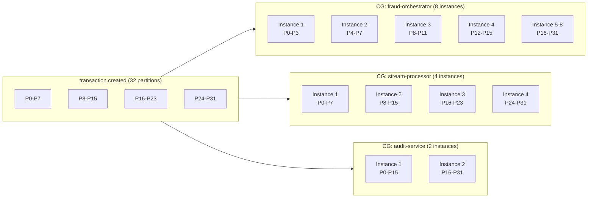
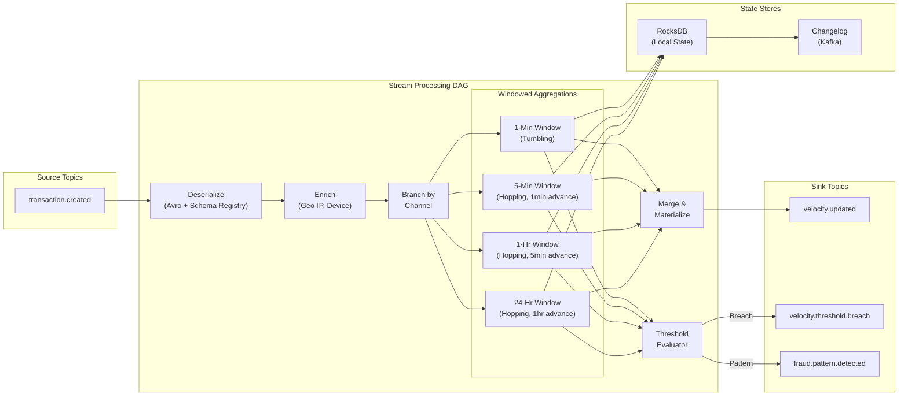
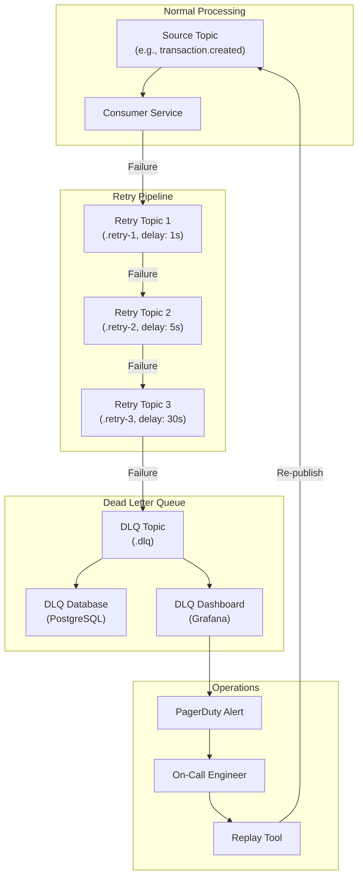
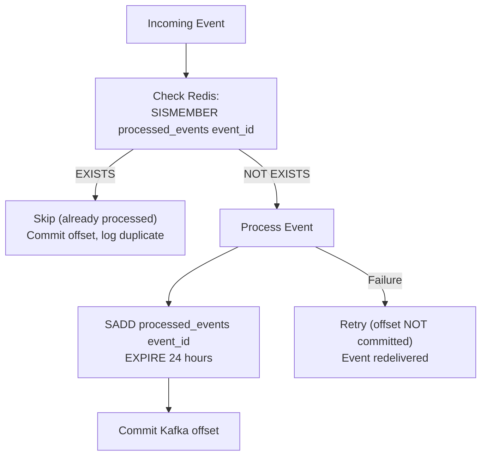
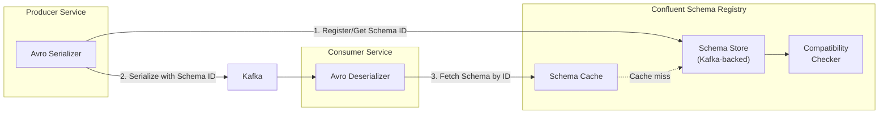

# Data Flow Architecture — Real-Time Fraud Detection Platform

> **Version:** 1.0.0  
> **Last Updated:** 2026-05-30  
> **Status:** Production  
> **Maintainers:** Fraud Platform Engineering Team

---

## Table of Contents

1. [Event-Driven Architecture Overview](#event-driven-architecture-overview)
2. [Kafka Cluster Configuration](#kafka-cluster-configuration)
3. [Kafka Topics Inventory](#kafka-topics-inventory)
4. [Event Flow Diagram](#event-flow-diagram)
5. [Event Envelope Specification](#event-envelope-specification)
6. [Stream Processing & Aggregations](#stream-processing--aggregations)
7. [Retry Strategy](#retry-strategy)
8. [Dead Letter Queue Strategy](#dead-letter-queue-strategy)
9. [Idempotency Handling](#idempotency-handling)
10. [Schema Evolution Strategy](#schema-evolution-strategy)
11. [Monitoring & Observability](#monitoring--observability)

---

## Event-Driven Architecture Overview

The Real-Time Fraud Detection Platform is built on an **event-driven architecture (EDA)** where Apache Kafka serves as the central nervous system. All significant state changes are captured as immutable, ordered events in Kafka topics. Services produce and consume events asynchronously, enabling:

- **Loose coupling** — producers and consumers evolve independently
- **Temporal decoupling** — events are durably stored, consumers process at their own pace
- **Event sourcing** — the event log is the source of truth; state can be reconstructed by replaying events
- **Fan-out** — a single event can trigger multiple downstream consumers without producer awareness
- **Auditability** — every state change is captured with full provenance metadata

### Architecture Principles

| Principle | Implementation |
|---|---|
| **Exactly-Once Semantics (EOS)** | Idempotent producers + transactional consumers + deduplication in Redis |
| **Ordered Processing** | Partition-key routing ensures per-entity ordering (customer_id or transaction_id) |
| **Schema Governance** | Avro schemas with Confluent Schema Registry; backward-compatible evolution only |
| **Backpressure Management** | Consumer lag monitoring → auto-scaling consumer group instances |
| **Dead Letter Queues** | Failed events routed to DLQ topics after retry exhaustion |
| **Event Immutability** | Events are never modified; corrections are published as new compensating events |

---

## Kafka Cluster Configuration

### Broker Configuration

| Parameter | Value | Rationale |
|---|---|---|
| `broker.count` | 5 | Handles 100M+ events/day with headroom |
| `num.partitions` (default) | 16 | Default for new topics; overridden per topic |
| `default.replication.factor` | 3 | Survives loss of 1 broker without data loss |
| `min.insync.replicas` | 2 | Guarantees durability with `acks=all` |
| `log.retention.hours` | 168 (7 days) | Default retention; overridden per topic |
| `log.segment.bytes` | 1 GB | Segment size for efficient cleanup |
| `log.cleanup.policy` | delete | Default; `compact` for state topics |
| `compression.type` | lz4 | Balance of speed and compression ratio |
| `message.max.bytes` | 1 MB | Maximum event payload size |
| `num.io.threads` | 16 | I/O throughput for high-volume topics |
| `num.network.threads` | 8 | Network thread pool for broker connections |

### Producer Configuration

| Parameter | Value | Rationale |
|---|---|---|
| `acks` | all | Maximum durability guarantee |
| `enable.idempotence` | true | Exactly-once per partition |
| `max.in.flight.requests.per.connection` | 5 | Maximum with idempotence enabled |
| `retries` | 2147483647 | Infinite retries (bounded by `delivery.timeout.ms`) |
| `delivery.timeout.ms` | 120000 | 2-minute delivery timeout |
| `batch.size` | 64 KB | Batch for throughput |
| `linger.ms` | 10 | Allow small batching window |
| `compression.type` | lz4 | Consistent with broker config |

### Consumer Configuration

| Parameter | Value | Rationale |
|---|---|---|
| `isolation.level` | read_committed | Only read committed transactional messages |
| `enable.auto.commit` | false | Manual offset management for EOS |
| `max.poll.records` | 500 | Bounded batch processing |
| `max.poll.interval.ms` | 300000 | 5-minute processing window |
| `session.timeout.ms` | 45000 | Consumer heartbeat timeout |
| `heartbeat.interval.ms` | 15000 | Heartbeat frequency |
| `auto.offset.reset` | earliest | Process all unread events on new consumer group |

---

## Kafka Topics Inventory

### Core Transaction Topics

| # | Topic Name | Partitions | Replication | Retention | Cleanup | Key | Value Schema | Description |
|---|---|---|---|---|---|---|---|---|
| 1 | `transaction.created` | 32 | 3 | 7 days | delete | `customer_id` | `TransactionCreatedEvent` | Raw transaction submitted by client, validated and enriched |
| 2 | `transaction.enriched` | 32 | 3 | 7 days | delete | `customer_id` | `TransactionEnrichedEvent` | Transaction with fraud scores, risk flags, and profile data |
| 3 | `transaction.updated` | 16 | 3 | 7 days | delete | `transaction_id` | `TransactionUpdatedEvent` | Status changes (approved, declined, held, reversed) |
| 4 | `transaction.batch.created` | 8 | 3 | 3 days | delete | `batch_id` | `BatchTransactionEvent` | Batch-ingested transactions from file upload or partner feed |

### Fraud Scoring Topics

| # | Topic Name | Partitions | Replication | Retention | Cleanup | Key | Value Schema | Description |
|---|---|---|---|---|---|---|---|---|
| 5 | `fraud.scored` | 32 | 3 | 14 days | delete | `transaction_id` | `FraudScoredEvent` | Aggregated fraud score from all scoring engines |
| 6 | `fraud.ml.scored` | 16 | 3 | 14 days | delete | `transaction_id` | `MLScoredEvent` | ML model prediction result with feature vector |
| 7 | `fraud.rule.evaluated` | 16 | 3 | 14 days | delete | `transaction_id` | `RuleEvaluatedEvent` | Rule engine evaluation result with triggered rules |
| 8 | `fraud.pattern.detected` | 16 | 3 | 30 days | delete | `customer_id` | `PatternDetectedEvent` | Anomalous pattern detected by stream processor |
| 9 | `fraud.feedback` | 8 | 3 | 90 days | delete | `transaction_id` | `FraudFeedbackEvent` | Analyst disposition feedback for model retraining |

### Alert & Case Topics

| # | Topic Name | Partitions | Replication | Retention | Cleanup | Key | Value Schema | Description |
|---|---|---|---|---|---|---|---|---|
| 10 | `alert.created` | 16 | 3 | 30 days | delete | `alert_id` | `AlertCreatedEvent` | New fraud alert generated from scoring threshold breach |
| 11 | `alert.updated` | 16 | 3 | 30 days | delete | `alert_id` | `AlertUpdatedEvent` | Alert status changes (acknowledged, investigating, closed) |
| 12 | `case.opened` | 8 | 3 | 90 days | delete | `case_id` | `CaseOpenedEvent` | New investigation case created from alert escalation |
| 13 | `case.updated` | 8 | 3 | 90 days | delete | `case_id` | `CaseUpdatedEvent` | Case status changes, notes, assignments |
| 14 | `case.closed` | 8 | 3 | 90 days | delete | `case_id` | `CaseClosedEvent` | Case disposition: confirmed fraud, false positive, inconclusive |

### Velocity & Aggregation Topics

| # | Topic Name | Partitions | Replication | Retention | Cleanup | Key | Value Schema | Description |
|---|---|---|---|---|---|---|---|---|
| 15 | `velocity.updated` | 32 | 3 | 3 days | delete | `customer_id` | `VelocityUpdatedEvent` | Real-time velocity counters (count, sum, avg per window) |
| 16 | `velocity.threshold.breach` | 16 | 3 | 7 days | delete | `customer_id` | `VelocityBreachEvent` | Velocity threshold exceeded (triggers immediate scoring) |

### Notification & Audit Topics

| # | Topic Name | Partitions | Replication | Retention | Cleanup | Key | Value Schema | Description |
|---|---|---|---|---|---|---|---|---|
| 17 | `notification.requested` | 8 | 3 | 3 days | delete | `recipient_id` | `NotificationRequestedEvent` | Multi-channel notification request (email, SMS, webhook) |
| 18 | `notification.delivered` | 8 | 3 | 7 days | delete | `notification_id` | `NotificationDeliveredEvent` | Delivery confirmation with channel and timestamp |
| 19 | `audit.event` | 16 | 3 | 365 days | delete | `entity_id` | `AuditEvent` | Immutable audit log for all system actions and data access |
| 20 | `config.changed` | 4 | 3 | 30 days | compact | `config_key` | `ConfigChangedEvent` | Configuration changes (rules, thresholds, model versions) |

### State & System Topics

| # | Topic Name | Partitions | Replication | Retention | Cleanup | Key | Value Schema | Description |
|---|---|---|---|---|---|---|---|---|
| 21 | `customer.profile.updated` | 16 | 3 | 7 days | compact | `customer_id` | `CustomerProfileEvent` | Customer profile changes, risk level updates |
| 22 | `model.deployed` | 4 | 3 | 90 days | delete | `model_id` | `ModelDeployedEvent` | ML model deployment events (version, metrics, rollback) |
| 23 | `system.health` | 4 | 3 | 1 day | delete | `service_id` | `HealthCheckEvent` | Service health heartbeats and status changes |
| 24 | `dlq.metrics` | 4 | 3 | 7 days | delete | `source_topic` | `DLQMetricsEvent` | DLQ depth and processing metrics for monitoring |

### Dead Letter Queue Topics

| # | Topic Name | Partitions | Replication | Retention | Cleanup | Key | Value Schema | Description |
|---|---|---|---|---|---|---|---|---|
| 25 | `transaction.created.dlq` | 4 | 3 | 30 days | delete | `original_key` | `DeadLetterEnvelope` | Failed `transaction.created` events after retry exhaustion |
| 26 | `fraud.scored.dlq` | 4 | 3 | 30 days | delete | `original_key` | `DeadLetterEnvelope` | Failed `fraud.scored` events after retry exhaustion |
| 27 | `alert.created.dlq` | 4 | 3 | 30 days | delete | `original_key` | `DeadLetterEnvelope` | Failed `alert.created` events after retry exhaustion |

---

## Event Flow Diagram



### Consumer Group Topology



---

## Event Envelope Specification

All events follow a standardized envelope format ensuring consistent metadata across the platform:

### Envelope Structure

```json
{
  "metadata": {
    "event_id": "evt_01HXYZ789ABC",
    "event_type": "transaction.created",
    "event_version": "1.2.0",
    "timestamp": "2026-05-30T12:00:00.000Z",
    "source_service": "transaction-service",
    "source_instance": "txn-service-pod-5d8b7f-abc12",
    "correlation_id": "corr_01HXYZ789DEF",
    "trace_id": "0af7651916cd43dd8448eb211c80319c",
    "span_id": "b7ad6b7169203331",
    "partition_key": "cust_123456",
    "schema_version": "1.2.0",
    "content_type": "application/avro"
  },
  "payload": {
    // Event-specific data (Avro-serialized)
  },
  "context": {
    "tenant_id": "tenant_acme_bank",
    "region": "us-east-1",
    "environment": "production",
    "idempotency_key": "idem_01HXYZ789GHI"
  }
}
```

### Metadata Fields

| Field | Type | Required | Description |
|---|---|---|---|
| `event_id` | string (ULID) | ✅ | Globally unique, time-sortable event identifier |
| `event_type` | string | ✅ | Fully qualified event type (topic name) |
| `event_version` | string (semver) | ✅ | Schema version of the event payload |
| `timestamp` | ISO 8601 | ✅ | Event creation timestamp (UTC) |
| `source_service` | string | ✅ | Producing service name |
| `source_instance` | string | ✅ | Pod/instance identifier |
| `correlation_id` | string (ULID) | ✅ | End-to-end request correlation ID |
| `trace_id` | string (hex) | ✅ | OpenTelemetry trace ID (W3C Trace Context) |
| `span_id` | string (hex) | ✅ | OpenTelemetry span ID |
| `partition_key` | string | ✅ | Kafka partition routing key |
| `schema_version` | string (semver) | ✅ | Avro schema version in Schema Registry |
| `content_type` | string | ✅ | Serialization format |

### Sample Event: `transaction.created`

```json
{
  "metadata": {
    "event_id": "evt_01J5KM7N8P9QRSTVWXYZ",
    "event_type": "transaction.created",
    "event_version": "1.2.0",
    "timestamp": "2026-05-30T12:00:00.123Z",
    "source_service": "transaction-service",
    "source_instance": "txn-service-pod-5d8b7f-x9k2m",
    "correlation_id": "corr_01J5KM7N8P9QRST00001",
    "trace_id": "4bf92f3577b34da6a3ce929d0e0e4736",
    "span_id": "00f067aa0ba902b7",
    "partition_key": "cust_789012",
    "schema_version": "1.2.0",
    "content_type": "application/avro"
  },
  "payload": {
    "transaction_id": "txn_01J5KM7N8P9QRST12345",
    "customer_id": "cust_789012",
    "account_id": "acc_456789",
    "amount": 2499.99,
    "currency": "USD",
    "merchant": {
      "id": "merch_112233",
      "name": "Electronics Plus",
      "mcc_code": "5732",
      "country": "US",
      "city": "New York"
    },
    "channel": "ONLINE",
    "card_token": "tok_xxxxxxxxxxxx4242",
    "device": {
      "fingerprint": "fp_abc123def456",
      "ip_address": "203.0.113.42",
      "user_agent": "Mozilla/5.0...",
      "geo": {
        "country": "US",
        "region": "NY",
        "city": "New York",
        "latitude": 40.7128,
        "longitude": -74.0060
      }
    },
    "timestamp": "2026-05-30T12:00:00.100Z",
    "status": "PENDING"
  },
  "context": {
    "tenant_id": "tenant_acme_bank",
    "region": "us-east-1",
    "environment": "production",
    "idempotency_key": "idem_01J5KM7N8P9QRST99999"
  }
}
```

---

## Stream Processing & Aggregations

### Velocity Window Aggregations

The Stream Processor (Kafka Streams / Apache Flink) maintains real-time sliding-window aggregations for fraud detection features:

| Window | Duration | Granularity | Metrics Computed | Storage | Use Case |
|---|---|---|---|---|---|
| **Micro** | 1 minute | Per-second buckets | `txn_count`, `txn_sum`, `distinct_merchants` | Redis (EXPIRE 120s) | Rapid-fire detection (card testing attacks) |
| **Short** | 5 minutes | Per-minute buckets | `txn_count`, `txn_sum`, `avg_amount`, `max_amount`, `distinct_merchants`, `distinct_countries` | Redis (EXPIRE 600s) | Burst detection, velocity spikes |
| **Medium** | 1 hour | Per-5-minute buckets | `txn_count`, `txn_sum`, `avg_amount`, `max_amount`, `std_dev_amount`, `distinct_merchants`, `distinct_mcc_codes`, `distinct_countries`, `channel_distribution` | Redis + TimescaleDB | Sustained anomaly detection |
| **Long** | 24 hours | Per-hour buckets | `txn_count`, `txn_sum`, `avg_amount`, `max_amount`, `min_amount`, `std_dev_amount`, `distinct_merchants`, `distinct_mcc_codes`, `distinct_countries`, `distinct_cities`, `channel_distribution`, `hour_distribution` | TimescaleDB | Behavioral baseline, daily patterns |

### Aggregation Key Dimensions

Aggregations are computed across multiple key dimensions simultaneously:

| Dimension Key | Format | Example | Purpose |
|---|---|---|---|
| `customer_id` | `cust_{id}` | `cust_789012` | Per-customer velocity |
| `account_id` | `acc_{id}` | `acc_456789` | Per-account velocity |
| `card_token` | `tok_{hash}` | `tok_xxxx4242` | Per-card velocity |
| `customer_id + merchant_id` | `cust_{id}:merch_{id}` | `cust_789012:merch_112233` | Customer-merchant pair frequency |
| `customer_id + country` | `cust_{id}:geo_{cc}` | `cust_789012:geo_US` | Cross-border detection |
| `ip_address` | `ip_{addr}` | `ip_203.0.113.42` | IP-based velocity (fraud rings) |
| `device_fingerprint` | `dev_{fp}` | `dev_fp_abc123` | Device-based velocity |

### Redis Data Structures for Velocity

```
# Transaction count (1-minute window)
INCR   velocity:cust:cust_789012:1min:count
EXPIRE velocity:cust:cust_789012:1min:count 120

# Transaction sum (1-minute window)
INCRBYFLOAT velocity:cust:cust_789012:1min:sum 2499.99
EXPIRE      velocity:cust:cust_789012:1min:sum 120

# Distinct merchants (5-minute window) — HyperLogLog
PFADD  velocity:cust:cust_789012:5min:merchants merch_112233
EXPIRE velocity:cust:cust_789012:5min:merchants 600

# Sorted set for time-ordered transactions (1-hour window)
ZADD   velocity:cust:cust_789012:1hr:txns 1748606400 txn_01J5KM7N8P9QRST12345
EXPIRE velocity:cust:cust_789012:1hr:txns 7200

# Prune entries older than window
ZREMRANGEBYSCORE velocity:cust:cust_789012:1hr:txns -inf (1748602800)
```

### Velocity Threshold Configuration

| Metric | 1-Minute | 5-Minute | 1-Hour | 24-Hour | Action |
|---|---|---|---|---|---|
| `txn_count` | > 5 | > 15 | > 50 | > 200 | Flag for review |
| `txn_sum` (USD) | > $5,000 | > $10,000 | > $25,000 | > $100,000 | Escalate to scoring |
| `distinct_merchants` | > 3 | > 8 | > 20 | > 50 | Anomaly flag |
| `distinct_countries` | > 1 | > 2 | > 3 | > 5 | Geo-anomaly flag |
| `max_amount` | > $2,500 | > $5,000 | > $10,000 | > $25,000 | High-value flag |

### Stream Processing Topology (Kafka Streams)



---

## Retry Strategy

### Exponential Backoff Configuration

All Kafka consumers implement a retry strategy with exponential backoff before routing to Dead Letter Queues:

```
Attempt 1 (original)  → Process event
         ↓ (failure)
Retry 1               → Wait 1 second  → Process event
         ↓ (failure)
Retry 2               → Wait 5 seconds → Process event
         ↓ (failure)
Retry 3               → Wait 30 seconds → Process event
         ↓ (failure)
Dead Letter Queue      → Route to {topic}.dlq
```

### Retry Configuration Table

| Parameter | Value | Description |
|---|---|---|
| `max.retries` | 3 | Maximum retry attempts before DLQ |
| `initial.backoff.ms` | 1,000 | First retry delay (1 second) |
| `backoff.multiplier` | 5 | Multiplier between retries |
| `max.backoff.ms` | 30,000 | Maximum backoff delay (30 seconds) |
| `jitter.factor` | 0.2 | ±20% randomization to prevent thundering herd |
| `retry.timeout.ms` | 60,000 | Total retry budget per event (1 minute) |

### Retry Delay Schedule

| Attempt | Base Delay | With Jitter (±20%) | Cumulative Max |
|---|---|---|---|
| 1st retry | 1,000ms | 800ms – 1,200ms | ~1.2s |
| 2nd retry | 5,000ms | 4,000ms – 6,000ms | ~7.2s |
| 3rd retry | 30,000ms | 24,000ms – 36,000ms | ~43.2s |
| **Exhausted** | → **DLQ** | — | — |

### Retryable vs Non-Retryable Errors

| Category | Error Types | Action |
|---|---|---|
| **Retryable (transient)** | `ConnectionException`, `TimeoutException`, `UnavailableException`, `ServiceUnavailableException`, `TooManyRequestsException` | Retry with backoff |
| **Non-retryable (permanent)** | `DeserializationException`, `SchemaNotFoundException`, `ValidationException`, `IllegalArgumentException`, `AuthenticationException` | Immediately route to DLQ |
| **Poison pill** | `RecordTooLargeException`, `CorruptRecordException` | Immediately route to DLQ with CRITICAL alert |

### Retry Implementation Pattern

```java
@KafkaListener(topics = "transaction.created", groupId = "fraud-orchestrator")
@RetryableTopic(
    attempts = "4",  // 1 original + 3 retries
    backoff = @Backoff(
        delay = 1000,
        multiplier = 5,
        maxDelay = 30000
    ),
    dltStrategy = DltStrategy.FAIL_ON_ERROR,
    autoCreateTopics = "false",
    include = {
        ConnectException.class,
        TimeoutException.class,
        ServiceUnavailableException.class
    },
    exclude = {
        DeserializationException.class,
        ValidationException.class
    }
)
public void processTransaction(TransactionCreatedEvent event) {
    // Processing logic
}

@DltHandler
public void handleDlt(TransactionCreatedEvent event, 
                       @Header(KafkaHeaders.EXCEPTION_MESSAGE) String errorMsg) {
    // DLQ handling: persist, alert, metrics
}
```

---

## Dead Letter Queue Strategy

### DLQ Architecture



### DLQ Envelope

```json
{
  "original_event": { /* original event envelope */ },
  "dlq_metadata": {
    "dlq_id": "dlq_01J5KM7N8P9QRST54321",
    "original_topic": "transaction.created",
    "original_partition": 12,
    "original_offset": 847291,
    "original_timestamp": "2026-05-30T12:00:00.123Z",
    "error_class": "java.net.ConnectException",
    "error_message": "Connection refused: fraud-orchestrator:8082",
    "error_stacktrace": "java.net.ConnectException: Connection refused...[truncated]",
    "retry_count": 3,
    "retry_timestamps": [
      "2026-05-30T12:00:01.123Z",
      "2026-05-30T12:00:06.123Z",
      "2026-05-30T12:00:36.123Z"
    ],
    "consumer_group": "fraud-orchestrator",
    "consumer_instance": "fraud-orch-pod-7c9d3f-k8x2n",
    "dlq_timestamp": "2026-05-30T12:00:36.500Z",
    "status": "UNPROCESSED",
    "resolution": null
  }
}
```

### DLQ Operations

| Operation | Description | Trigger |
|---|---|---|
| **Auto-Alert** | PagerDuty notification when DLQ depth > 100 in 5 minutes | Prometheus alert rule |
| **Manual Replay** | Re-publish events from DLQ to original topic | Ops CLI tool or admin dashboard |
| **Selective Replay** | Replay events matching specific criteria (time range, error type) | Admin API |
| **Bulk Discard** | Mark events as resolved/discarded after investigation | Admin dashboard |
| **Auto-Purge** | Remove resolved DLQ entries older than 30 days | Scheduled job |

### DLQ Monitoring Metrics

| Metric | Type | Alert Threshold |
|---|---|---|
| `dlq.depth` (per topic) | Gauge | > 100 → P2, > 1,000 → P1 |
| `dlq.ingestion.rate` | Counter | > 10/min → P2, > 100/min → P1 |
| `dlq.oldest.message.age` | Gauge | > 1 hour → P3, > 24 hours → P2 |
| `dlq.replay.success.rate` | Gauge | < 90% → P3 |
| `dlq.total.unprocessed` | Gauge | > 5,000 → P1 |

---

## Idempotency Handling

### Deduplication Strategy

All event processing is idempotent, preventing duplicate processing from Kafka rebalances, producer retries, or replay operations:



### Redis Deduplication Implementation

```
# Check if event was already processed
SISMEMBER idempotency:{consumer_group}:{topic} {event_id}

# If not processed, process and mark as done (atomic)
MULTI
SADD idempotency:{consumer_group}:{topic} {event_id}
EXPIRE idempotency:{consumer_group}:{topic} 86400  # 24-hour TTL
EXEC
```

### Deduplication Configuration

| Parameter | Value | Description |
|---|---|---|
| **Store** | Redis Cluster | Sub-millisecond lookups |
| **Key Pattern** | `idempotency:{consumer_group}:{topic}` | Per consumer group, per topic |
| **Value** | `event_id` (ULID) | Unique event identifier |
| **TTL** | 24 hours (86,400 seconds) | Covers maximum retry + rebalance window |
| **Data Structure** | Redis SET | O(1) membership check via `SISMEMBER` |
| **Fallback** | PostgreSQL `processed_events` table | If Redis is unavailable, check DB with unique constraint |
| **Cleanup** | Automatic via Redis TTL + scheduled DB purge (weekly) | Prevents unbounded growth |

### Database-Level Idempotency (Belt and Suspenders)

In addition to Redis-based deduplication, database operations use idempotency constraints:

```sql
-- Transaction table uses event_id as idempotency key
CREATE TABLE transactions (
    transaction_id  UUID PRIMARY KEY,
    event_id        VARCHAR(26) UNIQUE NOT NULL,  -- ULID, dedup key
    customer_id     UUID NOT NULL,
    amount          DECIMAL(15,2) NOT NULL,
    status          VARCHAR(20) NOT NULL,
    created_at      TIMESTAMPTZ NOT NULL,
    -- ... other fields
    CONSTRAINT uq_event_id UNIQUE (event_id)
);

-- Upsert pattern for idempotent writes
INSERT INTO transactions (transaction_id, event_id, customer_id, amount, status, created_at)
VALUES ($1, $2, $3, $4, $5, $6)
ON CONFLICT (event_id) DO NOTHING
RETURNING transaction_id;
```

---

## Schema Evolution Strategy

### Schema Registry Architecture

All events use **Apache Avro** serialization with **Confluent Schema Registry** for schema management and evolution:



### Compatibility Configuration

| Parameter | Value | Description |
|---|---|---|
| **Compatibility Mode** | `BACKWARD` (default) | New schema can read data written by old schema |
| **Subject Naming** | `TopicNameStrategy` | One schema per topic |
| **Schema ID Encoding** | Magic byte (0x0) + 4-byte schema ID | Confluent wire format |
| **Cache Size** | 1,000 schemas | Per-service schema cache |
| **Auto-Registration** | Enabled in dev/staging, **disabled in production** | Production schemas registered via CI/CD pipeline |

### Compatibility Modes by Topic Category

| Topic Category | Compatibility | Rationale |
|---|---|---|
| Core events (`transaction.*`, `fraud.*`) | `BACKWARD` | Consumers must handle old and new formats |
| Alert/Case events (`alert.*`, `case.*`) | `BACKWARD` | Investigation tools must read historical events |
| Velocity events (`velocity.*`) | `FULL` | Both producer and consumer upgrades must be compatible |
| Config events (`config.*`) | `BACKWARD` | Config consumers may lag behind producers |
| Audit events (`audit.*`) | `BACKWARD` | Long-retention; must be readable for years |

### Schema Evolution Rules

| ✅ Allowed (Backward Compatible) | ❌ Prohibited (Breaking Change) |
|---|---|
| Add new field **with default value** | Remove existing field |
| Add new optional field | Rename existing field |
| Widen numeric type (int → long) | Change field type (string → int) |
| Add new enum value (with default) | Remove enum value |
| Add new union member | Change field from optional to required |

### Schema Versioning Example

```avro
// Version 1.0.0 - Initial schema
{
  "type": "record",
  "name": "TransactionCreatedEvent",
  "namespace": "com.fraudplatform.events.transaction",
  "fields": [
    {"name": "transaction_id", "type": "string"},
    {"name": "customer_id", "type": "string"},
    {"name": "amount", "type": {"type": "bytes", "logicalType": "decimal", "precision": 15, "scale": 2}},
    {"name": "currency", "type": "string"},
    {"name": "merchant_id", "type": "string"},
    {"name": "channel", "type": {"type": "enum", "name": "Channel", "symbols": ["ONLINE", "POS", "ATM", "MOBILE"]}},
    {"name": "timestamp", "type": {"type": "long", "logicalType": "timestamp-millis"}}
  ]
}

// Version 1.1.0 - Added device_fingerprint (optional field, backward compatible ✅)
{
  "type": "record",
  "name": "TransactionCreatedEvent",
  "namespace": "com.fraudplatform.events.transaction",
  "fields": [
    {"name": "transaction_id", "type": "string"},
    {"name": "customer_id", "type": "string"},
    {"name": "amount", "type": {"type": "bytes", "logicalType": "decimal", "precision": 15, "scale": 2}},
    {"name": "currency", "type": "string"},
    {"name": "merchant_id", "type": "string"},
    {"name": "channel", "type": {"type": "enum", "name": "Channel", "symbols": ["ONLINE", "POS", "ATM", "MOBILE"]}},
    {"name": "timestamp", "type": {"type": "long", "logicalType": "timestamp-millis"}},
    {"name": "device_fingerprint", "type": ["null", "string"], "default": null},
    {"name": "ip_address", "type": ["null", "string"], "default": null}
  ]
}

// Version 1.2.0 - Added new channel enum value (backward compatible ✅)
// ... "symbols": ["ONLINE", "POS", "ATM", "MOBILE", "WALLET"] with default "ONLINE"
```

### CI/CD Schema Validation Pipeline

```
Developer → Git Push → CI Pipeline:
  1. Lint Avro schema (syntax check)
  2. Test backward compatibility against Schema Registry
  3. Run contract tests (producer + consumer)
  4. Register schema (staging)
  5. Canary deploy producer (10% traffic)
  6. Validate consumer compatibility
  7. Full rollout + register schema (production)
```

---

## Monitoring & Observability

### Key Kafka Metrics

| Metric | Source | Alert Threshold | Dashboard |
|---|---|---|---|
| `kafka.consumer.lag` | Consumer | > 10,000 per partition → P2 | Consumer Lag Dashboard |
| `kafka.consumer.lag.rate` | Consumer | Increasing > 1,000/min → P2 | Consumer Lag Dashboard |
| `kafka.producer.record.send.rate` | Producer | < baseline × 0.5 → P3 | Producer Throughput |
| `kafka.producer.record.error.rate` | Producer | > 0.1% → P2 | Producer Errors |
| `kafka.broker.under.replicated.partitions` | Broker | > 0 → P1 | Cluster Health |
| `kafka.broker.offline.partitions` | Broker | > 0 → P0 | Cluster Health |
| `kafka.topic.message.rate` | Broker | Per-topic baseline deviation → P3 | Topic Dashboard |
| `dlq.depth` | Custom | > 100 → P2, > 1,000 → P1 | DLQ Dashboard |
| `event.processing.latency.p99` | Consumer | > 500ms → P3, > 2s → P2 | Latency Dashboard |
| `schema.registry.errors` | Registry | > 0 → P2 | Schema Dashboard |

### Distributed Tracing

All events carry OpenTelemetry trace context (`trace_id`, `span_id`) through Kafka headers, enabling end-to-end request tracing from API ingestion through scoring to alert generation.

```
Client Request (trace_id: abc123)
  └── API Gateway (span: gateway)
      └── Transaction Service (span: txn-validate)
          └── Kafka Produce (span: kafka-produce, topic: transaction.created)
              ├── Fraud Orchestrator (span: fraud-orchestrate)
              │   ├── gRPC: Rule Engine (span: rule-evaluate)
              │   ├── gRPC: ML Scoring (span: ml-predict)
              │   └── gRPC: Customer Profile (span: profile-fetch)
              ├── Stream Processor (span: velocity-aggregate)
              └── Audit Service (span: audit-log)
```

---

## References

- [High-Level Architecture](./high-level-architecture.md) — System overview, microservices inventory
- [Security Architecture](./security-architecture.md) — Authentication, authorization, encryption
- [Confluent Schema Registry Documentation](https://docs.confluent.io/platform/current/schema-registry/)
- [Kafka Streams Documentation](https://kafka.apache.org/documentation/streams/)

---

> **Document Classification:** Internal — Engineering  
> **Review Cadence:** Quarterly or upon significant data flow changes
