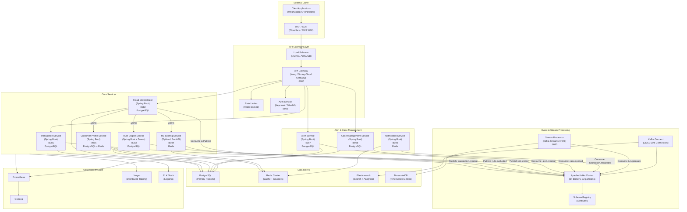
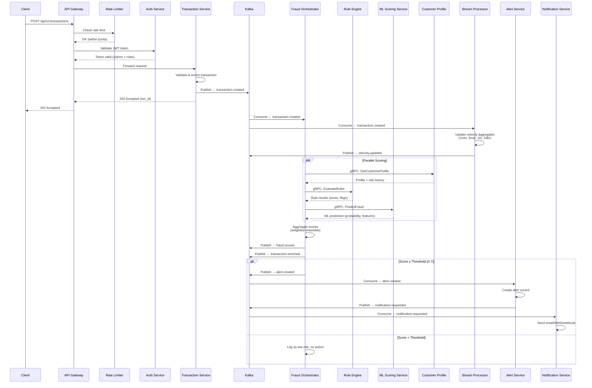
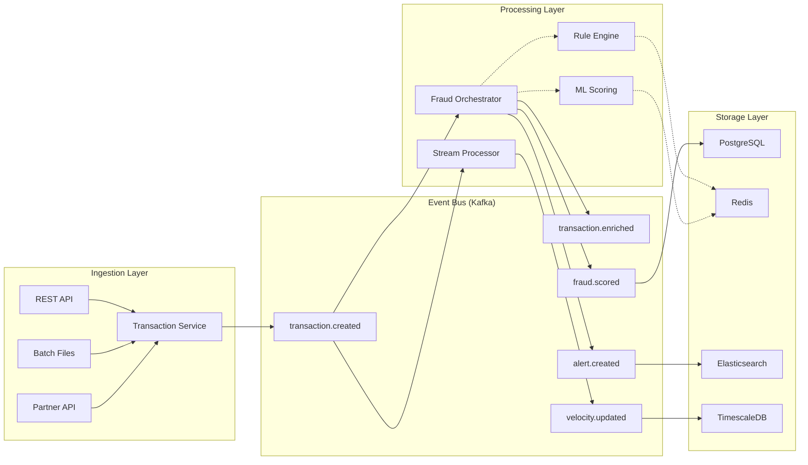
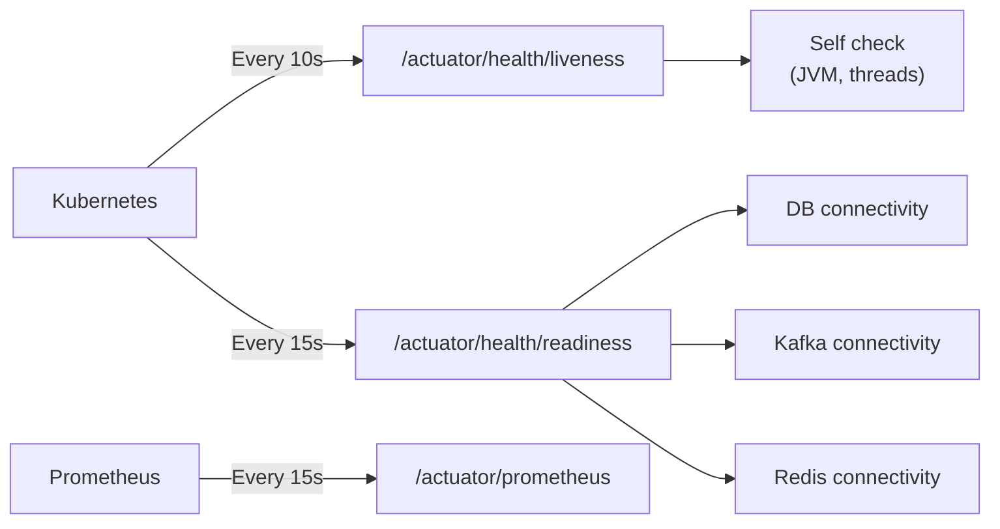
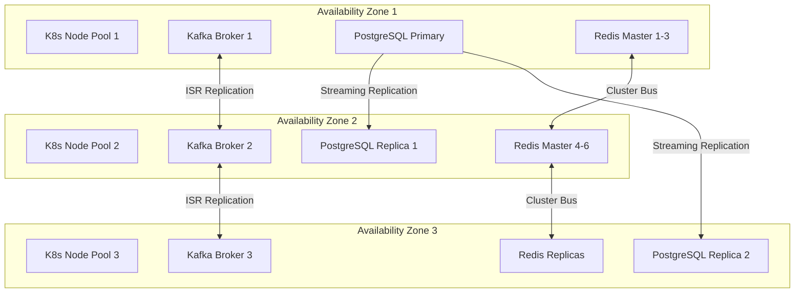

# High-Level Architecture — Real-Time Fraud Detection Platform

> **Version:** 1.0.0  
> **Last Updated:** 2026-05-30  
> **Status:** Production  
> **Maintainers:** Fraud Platform Engineering Team

---

## Table of Contents

1. [System Overview](#system-overview)
2. [Design Philosophy](#design-philosophy)
3. [High-Level Architecture Diagram](#high-level-architecture-diagram)
4. [Request Flow Sequence Diagram](#request-flow-sequence-diagram)
5. [Microservices Inventory](#microservices-inventory)
6. [Communication Patterns](#communication-patterns)
7. [Data Flow](#data-flow)
8. [Scalability Design](#scalability-design)
9. [Fault Tolerance](#fault-tolerance)
10. [Deployment Topology](#deployment-topology)

---

## System Overview

The Real-Time Fraud Detection Platform is an enterprise-grade, event-driven microservices architecture designed to detect, score, and prevent fraudulent financial transactions in real time. The platform processes **100 million+ transactions per day** (~1,160 TPS sustained, 5,000+ TPS peak) with a target latency of **< 100ms** for synchronous scoring and **< 500ms** end-to-end for the complete fraud evaluation pipeline.

### Key Capabilities

| Capability | Description |
|---|---|
| **Real-Time Scoring** | Sub-100ms fraud risk assessment using ML models and rule engines in parallel |
| **Stream Processing** | Continuous aggregation of velocity metrics (1min, 5min, 1hr, 24hr windows) |
| **Pattern Detection** | Behavioral analytics and anomaly detection across transaction sequences |
| **Case Management** | Automated alert generation, investigation workflows, and disposition tracking |
| **Adaptive Rules** | Hot-reloadable rule engine with A/B testing and canary deployments |
| **Regulatory Compliance** | PCI-DSS, SOX, GDPR-aligned data handling with full audit trails |

### Non-Functional Requirements

| Metric | Target |
|---|---|
| Availability | 99.99% (< 52 min downtime/year) |
| Latency (P50 / P99) | 25ms / 100ms (synchronous scoring) |
| Throughput | 100M transactions/day sustained |
| Data Retention | Hot: 90 days, Warm: 1 year, Cold: 7 years |
| Recovery Time Objective (RTO) | < 5 minutes |
| Recovery Point Objective (RPO) | < 1 minute |

---

## Design Philosophy

The platform is built on the following architectural principles:

### 1. Event-Driven First
All state changes propagate through Apache Kafka as immutable events. Services react to events rather than being orchestrated, enabling loose coupling and independent scalability. The event log serves as the authoritative source of truth.

### 2. Polyglot Persistence
Each microservice owns its data store, selected to match its access patterns:
- **PostgreSQL** for transactional, relational data (ACID guarantees)
- **Redis** for sub-millisecond caching and real-time counters
- **Elasticsearch** for full-text search and analytics dashboards
- **TimescaleDB** for time-series metrics and velocity aggregations

### 3. Defense in Depth
Security is layered across every tier: WAF → TLS 1.3 → Rate Limiting → JWT/OAuth2 → RBAC → mTLS → Field-Level Encryption. No single layer's failure compromises the system.

### 4. Design for Failure
Every inter-service call assumes the downstream will fail. Circuit breakers, retries with exponential backoff, bulkheads, timeouts, and dead-letter queues ensure graceful degradation.

### 5. Observability as a Feature
Distributed tracing (Jaeger), structured logging (ELK), metrics (Prometheus/Grafana), and health checks provide full visibility into system behavior across all services.

### 6. Domain-Driven Boundaries
Service boundaries align with business domains (Transactions, Fraud Scoring, Rules, Alerts, Cases) to minimize cross-service coupling and enable team autonomy.

---

## High-Level Architecture Diagram



---

## Request Flow Sequence Diagram

The following diagram illustrates the end-to-end flow of a transaction being submitted, scored for fraud, and resulting in an alert:



---

## Microservices Inventory

| # | Service Name | Port | Technology | Database | Cache | Primary Responsibility |
|---|---|---|---|---|---|---|
| 1 | **API Gateway** | 8080 | Kong / Spring Cloud Gateway | — | Redis | Request routing, rate limiting, JWT validation, TLS termination |
| 2 | **Transaction Service** | 8081 | Java 21 / Spring Boot 3.x | PostgreSQL 16 | Redis | Transaction ingestion, validation, enrichment, deduplication |
| 3 | **Fraud Orchestrator** | 8082 | Java 21 / Spring Boot 3.x | PostgreSQL 16 | Redis | Orchestrate parallel scoring, aggregate results, produce verdicts |
| 4 | **Rule Engine Service** | 8083 | Java 21 / Spring Boot 3.x + Drools 8 | PostgreSQL 16 | Redis | Business rule evaluation, hot-reload rules, threshold management |
| 5 | **ML Scoring Service** | 8084 | Python 3.12 / FastAPI | — | Redis | ML model inference (XGBoost, LightGBM, Neural Nets), feature store |
| 6 | **Customer Profile Service** | 8085 | Java 21 / Spring Boot 3.x | PostgreSQL 16 | Redis | Customer profiles, risk history, behavioral patterns, KYC data |
| 7 | **Auth Service** | 8086 | Keycloak 24 / OAuth2 + OIDC | PostgreSQL 16 | — | Authentication, JWT issuance, role management, MFA |
| 8 | **Alert Service** | 8087 | Java 21 / Spring Boot 3.x | PostgreSQL 16 | Redis | Fraud alert generation, severity classification, deduplication |
| 9 | **Case Management Service** | 8088 | Java 21 / Spring Boot 3.x | PostgreSQL 16 | — | Investigation workflows, case assignment, disposition tracking |
| 10 | **Notification Service** | 8089 | Java 21 / Spring Boot 3.x | — | Redis | Multi-channel notifications (email, SMS, webhook, Slack) |
| 11 | **Stream Processor** | 8090 | Kafka Streams / Apache Flink | TimescaleDB | Redis | Velocity aggregation, windowed computations, anomaly detection |
| 12 | **Reporting Service** | 8091 | Java 21 / Spring Boot 3.x | PostgreSQL 16 (read replica) | Redis | Dashboard data, analytics queries, regulatory reports |
| 13 | **Audit Service** | 8092 | Java 21 / Spring Boot 3.x | PostgreSQL 16 | — | Immutable audit log, compliance events, data access tracking |

---

## Communication Patterns

The platform employs three distinct communication patterns, each selected for specific use cases:

### 1. REST/HTTP — External & Synchronous API

| Aspect | Detail |
|---|---|
| **Usage** | Client-facing APIs, CRUD operations, dashboard queries |
| **Protocol** | HTTPS (TLS 1.3) |
| **Format** | JSON (application/json) |
| **Versioning** | URI-based: `/api/v1/`, `/api/v2/` |
| **Auth** | Bearer JWT (OAuth2) |
| **Rate Limiting** | Per-client, sliding window (Redis-backed) |
| **Idempotency** | `Idempotency-Key` header for POST/PUT |

**Key Endpoints:**

```
POST   /api/v1/transactions          → Submit new transaction
GET    /api/v1/transactions/{id}     → Get transaction details
POST   /api/v1/transactions/batch    → Batch submission
GET    /api/v1/alerts                → List alerts (paginated)
PATCH  /api/v1/alerts/{id}/status    → Update alert status
GET    /api/v1/cases/{id}            → Get case details
POST   /api/v1/cases/{id}/notes      → Add investigation note
GET    /api/v1/reports/fraud-summary → Dashboard metrics
```

### 2. gRPC — Internal Synchronous Scoring

| Aspect | Detail |
|---|---|
| **Usage** | Inter-service calls requiring low latency (< 10ms) |
| **Protocol** | HTTP/2 with mTLS |
| **Format** | Protocol Buffers (protobuf v3) |
| **Load Balancing** | Client-side (round-robin with health-aware routing) |
| **Deadlines** | 50ms default, configurable per RPC |
| **Retry Policy** | Max 2 retries, exponential backoff (10ms base) |

**Key Service Definitions:**

```protobuf
service FraudScoringService {
  rpc EvaluateTransaction (TransactionRequest) returns (ScoringResponse);
  rpc BatchEvaluate (stream TransactionRequest) returns (stream ScoringResponse);
}

service RuleEngineService {
  rpc EvaluateRules (RuleEvaluationRequest) returns (RuleEvaluationResponse);
  rpc GetActiveRules (Empty) returns (RuleSetResponse);
}

service CustomerProfileService {
  rpc GetProfile (ProfileRequest) returns (CustomerProfile);
  rpc GetRiskHistory (RiskHistoryRequest) returns (RiskHistoryResponse);
}

service MLScoringService {
  rpc Predict (PredictionRequest) returns (PredictionResponse);
  rpc BatchPredict (BatchPredictionRequest) returns (BatchPredictionResponse);
  rpc GetModelMetadata (Empty) returns (ModelMetadata);
}
```

### 3. Apache Kafka — Asynchronous Event Streaming

| Aspect | Detail |
|---|---|
| **Usage** | Event propagation, stream processing, async workflows |
| **Cluster** | 3+ brokers, rack-aware, cross-AZ replication |
| **Serialization** | Avro with Confluent Schema Registry |
| **Partitioning** | Key-based (customer_id or transaction_id) |
| **Replication** | Factor: 3 (min.insync.replicas: 2) |
| **Retention** | Topic-specific (7–30 days, compacted for state topics) |
| **Delivery** | Exactly-once semantics (EOS) with idempotent producers |

> See [Data Flow Architecture](./data-flow.md) for the complete topic inventory and event schemas.

---

## Data Flow



### Data Flow Stages

1. **Ingestion** — Transactions arrive via REST API, batch file processing, or partner integrations. The Transaction Service validates, deduplicates (idempotency key), enriches with metadata (geo-IP, device fingerprint), and publishes a `transaction.created` event.

2. **Fan-Out** — Kafka distributes the event to multiple consumers: the Fraud Orchestrator (for scoring), the Stream Processor (for velocity aggregation), and the Audit Service (for compliance logging).

3. **Parallel Scoring** — The Fraud Orchestrator makes concurrent gRPC calls to the Rule Engine, ML Scoring Service, and Customer Profile Service. Each returns an independent score.

4. **Score Aggregation** — Scores are combined using a weighted ensemble: `final_score = (0.4 × ML) + (0.35 × rules) + (0.25 × profile_risk)`. The result is published as `fraud.scored`.

5. **Decision & Action** — If the score exceeds the configured threshold (default: 0.7), an `alert.created` event triggers downstream alert generation, case opening, and multi-channel notifications.

6. **Feedback Loop** — Investigation outcomes feed back into ML model retraining and rule tuning, closing the feedback loop for continuous improvement.

---

## Scalability Design

### Horizontal Scaling Strategy

| Component | Scaling Mechanism | Min Replicas | Max Replicas | Scaling Trigger |
|---|---|---|---|---|
| API Gateway | HPA (K8s) | 3 | 20 | CPU > 60% or RPS > 5,000/pod |
| Transaction Service | HPA (K8s) | 5 | 50 | CPU > 70% or queue lag > 1,000 |
| Fraud Orchestrator | HPA (K8s) | 5 | 40 | CPU > 70% or Kafka lag > 5,000 |
| Rule Engine | HPA (K8s) | 3 | 20 | CPU > 65% or gRPC latency P99 > 50ms |
| ML Scoring Service | HPA (K8s) + GPU | 3 | 30 | GPU utilization > 70% or queue depth > 500 |
| Stream Processor | Kafka consumer groups | 3 | 32 | Equal to partition count |
| Kafka Brokers | Manual (planned) | 3 | 12 | Disk > 70% or replication lag > 5s |
| PostgreSQL | Read replicas | 1 primary + 2 replicas | 1 primary + 5 replicas | Read query latency > 50ms |
| Redis Cluster | Hash-slot rebalancing | 6 nodes (3 masters) | 18 nodes (9 masters) | Memory > 75% or ops/sec > 100K/node |

### Partitioning Strategy

- **Kafka Topics**: Partitioned by `customer_id` hash to ensure all transactions for a customer are processed in order within the same partition. Key topics use 32 partitions for high throughput.
- **PostgreSQL**: Table partitioning by `created_at` (monthly range partitions) for transaction and audit tables, enabling efficient time-range queries and partition pruning.
- **Redis**: Cluster mode with 16,384 hash slots distributed across master nodes. Velocity counters use consistent hashing by customer ID.

### Caching Architecture

```
┌──────────────────────────────────────────────────────────┐
│                     Caching Layers                       │
├────────────┬─────────────────────────────────────────────┤
│ Layer      │ Details                                     │
├────────────┼─────────────────────────────────────────────┤
│ L1 - Local │ Caffeine (in-JVM), 10K entries, 60s TTL    │
│            │ Hot rules, model metadata, config           │
├────────────┼─────────────────────────────────────────────┤
│ L2 - Redis │ Redis Cluster, sub-ms latency               │
│            │ Customer profiles (5min TTL)                │
│            │ Velocity counters (sliding windows)         │
│            │ Fraud scores (10min TTL)                    │
│            │ Idempotency keys (24hr TTL)                 │
├────────────┼─────────────────────────────────────────────┤
│ L3 - DB    │ PostgreSQL with connection pooling (HikariCP)│
│            │ Read replicas for analytics queries         │
└────────────┴─────────────────────────────────────────────┘
```

**Cache Invalidation**: Write-through for critical data (customer profiles), event-driven invalidation via Kafka for eventually-consistent data (rules, model versions).

---

## Fault Tolerance

### Circuit Breaker Configuration

All inter-service calls are wrapped with Resilience4j circuit breakers:

| Parameter | Value | Rationale |
|---|---|---|
| Failure Rate Threshold | 50% | Trip after half of calls fail |
| Slow Call Rate Threshold | 80% | Trip if 80% of calls exceed duration |
| Slow Call Duration | 2 seconds | Definition of a "slow" call |
| Sliding Window Type | COUNT_BASED | Last 100 calls evaluated |
| Sliding Window Size | 100 | Sample size for failure rate calculation |
| Minimum Calls | 20 | Minimum calls before evaluation |
| Wait Duration (Open → Half-Open) | 30 seconds | Recovery probe interval |
| Permitted Calls in Half-Open | 10 | Probe calls to test recovery |
| Automatic Transition | Enabled | Open → Half-Open after wait |

### Retry Strategy

```yaml
retry:
  maxAttempts: 3
  backoff:
    initial: 1s
    multiplier: 5
    max: 30s
  retryableExceptions:
    - java.net.ConnectException
    - io.grpc.StatusRuntimeException (UNAVAILABLE)
    - org.apache.kafka.common.errors.TimeoutException
  nonRetryableExceptions:
    - java.lang.IllegalArgumentException
    - io.grpc.StatusRuntimeException (INVALID_ARGUMENT)
```

| Attempt | Delay | Cumulative |
|---|---|---|
| 1st retry | 1s | 1s |
| 2nd retry | 5s | 6s |
| 3rd retry | 30s | 36s |
| Exhausted | → Dead Letter Queue | — |

### Dead Letter Queue (DLQ) Strategy

Events that exhaust all retries are routed to topic-specific DLQs:

```
transaction.created       → transaction.created.dlq
fraud.scored              → fraud.scored.dlq
alert.created             → alert.created.dlq
```

DLQ events include enriched metadata:
- Original event payload
- Error class and message
- Retry count and timestamps
- Stack trace (truncated)
- Source service and consumer group

DLQ monitoring triggers PagerDuty alerts when depth exceeds configurable thresholds (default: 100 messages).

### Health Check Architecture



| Probe | Endpoint | Interval | Timeout | Failure Threshold |
|---|---|---|---|---|
| **Liveness** | `/actuator/health/liveness` | 10s | 5s | 3 consecutive failures → pod restart |
| **Readiness** | `/actuator/health/readiness` | 15s | 10s | 2 consecutive failures → remove from LB |
| **Startup** | `/actuator/health/startup` | 5s | 10s | 30 failures → kill pod (max 150s startup) |

### Graceful Degradation Modes

| Scenario | Degradation Behavior |
|---|---|
| ML Service down | Fall back to rule-engine-only scoring (higher false positive rate accepted) |
| Rule Engine down | Apply default conservative rules (block transactions > $10K) |
| Redis down | Bypass cache, query DB directly (increased latency, reduced throughput) |
| Kafka lag > 10K | Activate backpressure, reduce batch sizes, alert ops team |
| PostgreSQL failover | Automatic failover via Patroni, ~10s interruption, read replicas absorb reads |
| Full scoring pipeline down | Queue transactions for deferred processing, return 202 with "pending" status |

---

## Deployment Topology



### Kubernetes Resource Quotas (per service)

| Resource | Request | Limit |
|---|---|---|
| CPU | 500m | 2000m |
| Memory | 512Mi | 2Gi |
| Ephemeral Storage | 100Mi | 500Mi |

> **Note:** ML Scoring Service pods have GPU resource requests (`nvidia.com/gpu: 1`) and elevated memory limits (4Gi).

---

## References

- [Data Flow Architecture](./data-flow.md) — Kafka topics, event schemas, stream processing
- [Security Architecture](./security-architecture.md) — Authentication, authorization, encryption, compliance
- [API Specifications](../api/) — OpenAPI 3.0 specs for all REST endpoints
- [Runbooks](../runbooks/) — Operational procedures and incident response

---

> **Document Classification:** Internal — Engineering  
> **Review Cadence:** Quarterly or upon significant architectural changes
