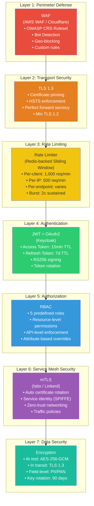
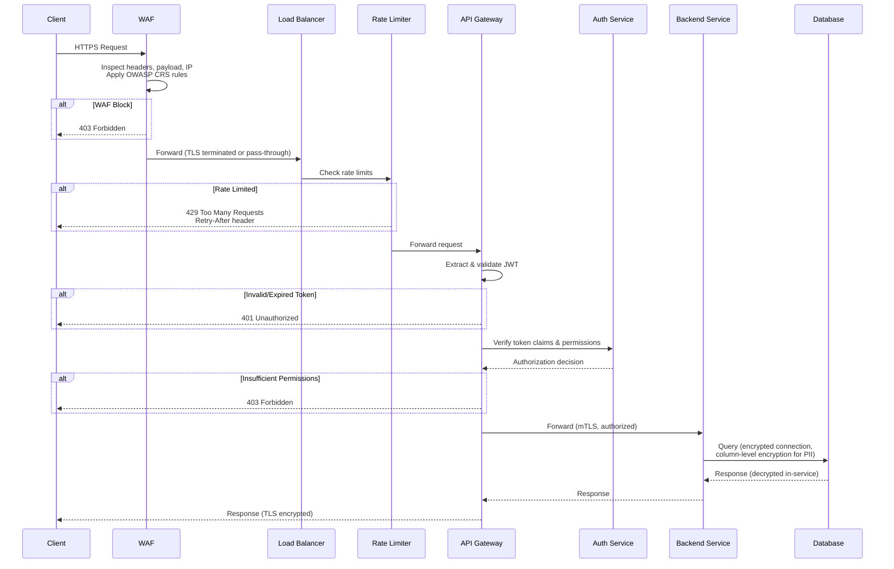
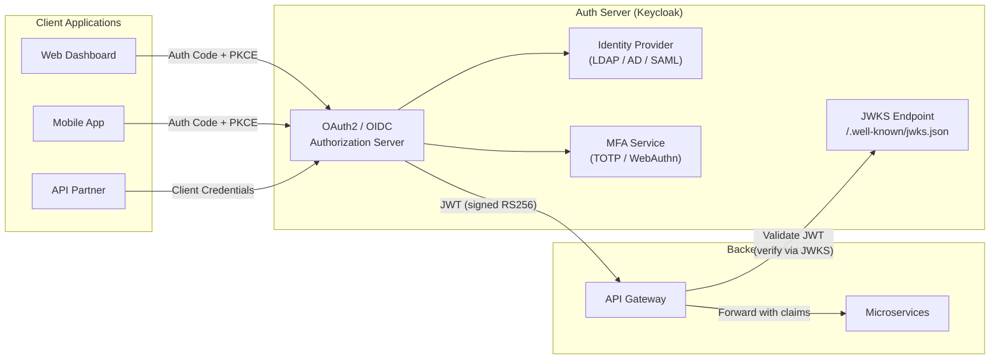
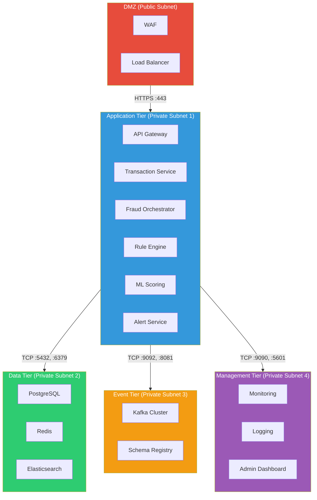
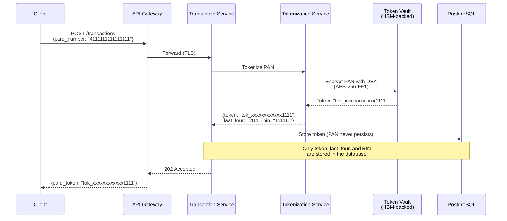
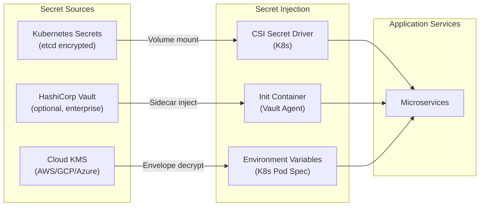
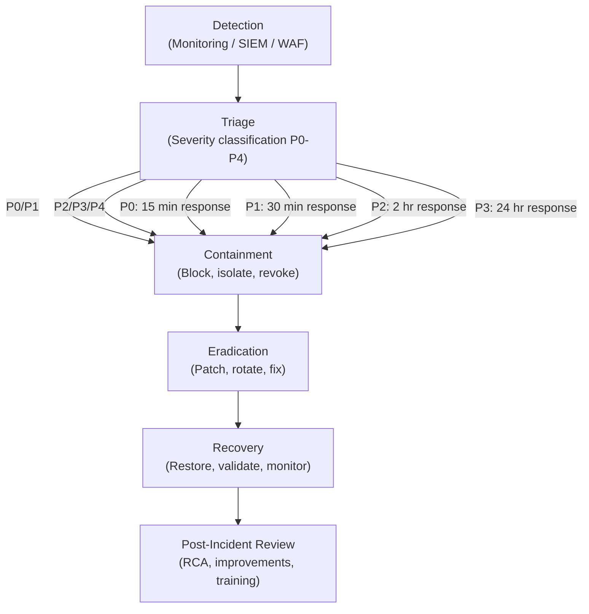

# Security Architecture — Real-Time Fraud Detection Platform

> **Version:** 1.0.0  
> **Last Updated:** 2026-05-30  
> **Status:** Production  
> **Maintainers:** Fraud Platform Security Team  
> **Classification:** Internal — Confidential

---

## Table of Contents

1. [Security Overview](#security-overview)
2. [Threat Model Summary](#threat-model-summary)
3. [Security Layers Diagram](#security-layers-diagram)
4. [Authentication](#authentication)
5. [Authorization (RBAC)](#authorization-rbac)
6. [Network Security](#network-security)
7. [Data Security](#data-security)
8. [PCI-DSS Compliance](#pci-dss-compliance)
9. [Secrets Management](#secrets-management)
10. [Audit Trail Requirements](#audit-trail-requirements)
11. [OWASP Top 10 Mitigations](#owasp-top-10-mitigations)
12. [Security Monitoring & Incident Response](#security-monitoring--incident-response)

---

## Security Overview

The Real-Time Fraud Detection Platform implements a **defense-in-depth** security architecture where multiple independent security controls protect the system at every layer. A compromise of any single layer does not grant an attacker full access to the system.

### Security Design Principles

| Principle | Implementation |
|---|---|
| **Defense in Depth** | 7 security layers from perimeter to data (WAF → TLS → Rate Limiting → JWT → RBAC → mTLS → Encryption) |
| **Zero Trust** | Every service request is authenticated and authorized; no implicit trust based on network location |
| **Least Privilege** | Services and users receive minimum permissions required for their function |
| **Separation of Duties** | No single role can approve and execute a fraud disposition |
| **Fail Secure** | Authentication/authorization failures default to deny; degraded modes block rather than allow |
| **Immutable Audit** | All access and actions are logged to append-only audit logs with tamper detection |
| **Data Minimization** | Only collect and retain PII necessary for fraud detection; mask/tokenize at rest |

### Security Scope

```
┌─────────────────────────────────────────────────────────────────┐
│                        Security Perimeter                       │
│                                                                 │
│  ┌──────────┐ ┌──────────┐ ┌──────────┐ ┌──────────────────┐   │
│  │ External │ │ Network  │ │ Service  │ │ Data Layer       │   │
│  │ Defense  │ │ Security │ │ Security │ │                  │   │
│  │          │ │          │ │          │ │ • Encryption     │   │
│  │ • WAF    │ │ • mTLS   │ │ • AuthN  │ │ • Tokenization   │   │
│  │ • DDoS   │ │ • NetPol │ │ • AuthZ  │ │ • Masking        │   │
│  │ • CDN    │ │ • Mesh   │ │ • RBAC   │ │ • Key Mgmt       │   │
│  └──────────┘ └──────────┘ └──────────┘ └──────────────────┘   │
│                                                                 │
│  ┌──────────────────────────────────────────────────────────┐   │
│  │ Cross-Cutting: Audit Logging │ Monitoring │ Compliance   │   │
│  └──────────────────────────────────────────────────────────┘   │
└─────────────────────────────────────────────────────────────────┘
```

---

## Threat Model Summary

### STRIDE Threat Analysis

| Threat Category | Threat Example | Likelihood | Impact | Risk | Mitigation |
|---|---|---|---|---|---|
| **Spoofing** | Attacker uses stolen credentials to submit fraudulent transactions | High | Critical | Critical | MFA, JWT with short TTL, device fingerprinting |
| **Tampering** | Attacker modifies transaction amount in transit | Medium | Critical | High | TLS 1.3, request signing, payload integrity checks |
| **Repudiation** | Insider denies modifying fraud rules | Medium | High | High | Immutable audit log, all changes attributed to authenticated user |
| **Information Disclosure** | Exfiltration of cardholder data from database | Medium | Critical | Critical | AES-256 encryption, PCI-DSS controls, network segmentation |
| **Denial of Service** | Volumetric attack overwhelming the transaction API | High | High | High | WAF, CDN, rate limiting, auto-scaling, circuit breakers |
| **Elevation of Privilege** | Analyst escalates to admin via API manipulation | Low | Critical | High | RBAC enforcement at gateway + service level, JWT claims validation |

### Attack Surface Inventory

| Surface | Exposure | Controls |
|---|---|---|
| Public REST API (`:8080`) | Internet-facing | WAF, TLS, rate limiting, JWT, input validation |
| Admin Dashboard (`:3000`) | Internal VPN | VPN + SSO, MFA, IP allowlist, RBAC |
| Kafka Brokers (`:9092`) | Cluster-internal | SASL/SCRAM, mTLS, ACLs, NetworkPolicy |
| PostgreSQL (`:5432`) | Cluster-internal | mTLS, role-based access, NetworkPolicy, encrypted at rest |
| Redis (`:6379`) | Cluster-internal | AUTH password, mTLS, NetworkPolicy, no external exposure |
| gRPC Services (`:8082-8085`) | Cluster-internal | mTLS, service mesh, NetworkPolicy |

---

## Security Layers Diagram



### Layer Interaction Flow



---

## Authentication

### OAuth2 + JWT Architecture

The platform uses **OAuth2 Authorization Code Flow** with **PKCE** for user-facing applications and **Client Credentials Flow** for service-to-service authentication:



### Token Configuration

| Token Type | TTL | Algorithm | Claims | Storage |
|---|---|---|---|---|
| **Access Token** | 15 minutes | RS256 (RSA 2048-bit) | `sub`, `roles`, `permissions`, `tenant_id`, `iss`, `exp`, `iat`, `jti` | Memory only (never persisted) |
| **Refresh Token** | 7 days | Opaque (server-side) | Reference to session | HttpOnly, Secure, SameSite=Strict cookie |
| **ID Token** | 15 minutes | RS256 | `sub`, `name`, `email`, `preferred_username` | Memory only |
| **Service Token** | 1 hour | RS256 | `client_id`, `scope`, `iss`, `exp` | In-memory cache (auto-refresh) |

### Access Token Structure (JWT)

```json
{
  "header": {
    "alg": "RS256",
    "typ": "JWT",
    "kid": "key-2026-05-01"
  },
  "payload": {
    "iss": "https://auth.fraudplatform.internal/realms/fraud-detection",
    "sub": "user_01HXYZ789ABC",
    "aud": "fraud-detection-api",
    "exp": 1748607600,
    "iat": 1748606700,
    "jti": "jwt_01J5KM7N8P9QRST44444",
    "type": "access",
    "roles": ["analyst"],
    "permissions": [
      "transactions:read",
      "alerts:read",
      "alerts:update",
      "cases:read",
      "reports:read"
    ],
    "tenant_id": "tenant_acme_bank",
    "mfa_verified": true,
    "session_id": "sess_01HXYZ789DEF"
  }
}
```

### Token Lifecycle Management

| Event | Action |
|---|---|
| **Login** | Issue access + refresh + ID tokens; set refresh token in HttpOnly cookie |
| **API Call** | Validate access token signature, expiry, issuer, audience; extract claims |
| **Token Expired** | Client uses refresh token to obtain new access token (silent refresh) |
| **Refresh Token Rotation** | On each refresh, old refresh token is invalidated; new one issued |
| **Logout** | Revoke refresh token, blacklist access token JTI in Redis (15-min TTL) |
| **Suspicious Activity** | Revoke all tokens for user/session; force re-authentication |
| **Key Rotation** | New signing key published to JWKS; old key remains valid for token lifetime |

### Token Blacklist (Revocation)

```
# Redis-based token blacklist for revoked access tokens
SET token:blacklist:{jti} "revoked" EX 900  # 15-min TTL (matches access token TTL)

# On each request, API Gateway checks:
EXISTS token:blacklist:{jti}
# If exists → 401 Unauthorized
```

### Multi-Factor Authentication (MFA)

| MFA Method | Use Case | Requirement |
|---|---|---|
| **TOTP** (Google Authenticator) | All users | Required for admin, analyst roles |
| **WebAuthn / FIDO2** | High-security users | Required for admin role, optional for others |
| **SMS OTP** (backup) | Recovery only | Backup method when primary MFA unavailable |
| **Email OTP** | Password reset | Required for password reset flow |

---

## Authorization (RBAC)

### Role Definitions

| Role | Description | Users | MFA Required |
|---|---|---|---|
| **`admin`** | Full system access: manage users, configure rules, deploy models, system settings | Platform administrators | ✅ WebAuthn + TOTP |
| **`analyst`** | Investigate alerts, manage cases, view transactions, access reports | Fraud analysts | ✅ TOTP |
| **`investigator`** | View and investigate assigned cases, add notes, request information | Field investigators | ✅ TOTP |
| **`viewer`** | Read-only access to dashboards and reports | Compliance officers, management | Optional |
| **`system`** | Service-to-service communication, automated processes | Microservices (Client Credentials) | N/A (mTLS) |

### Permission Matrix

| Resource | Operation | `admin` | `analyst` | `investigator` | `viewer` | `system` |
|---|---|---|---|---|---|---|
| **Transactions** | `read` | ✅ | ✅ | ✅ (assigned only) | ✅ (summary) | ✅ |
| **Transactions** | `create` | ✅ | ❌ | ❌ | ❌ | ✅ |
| **Transactions** | `update` | ✅ | ❌ | ❌ | ❌ | ✅ |
| **Alerts** | `read` | ✅ | ✅ | ✅ (assigned only) | ✅ (summary) | ✅ |
| **Alerts** | `update` (status) | ✅ | ✅ | ❌ | ❌ | ✅ |
| **Alerts** | `delete` | ✅ | ❌ | ❌ | ❌ | ❌ |
| **Cases** | `read` | ✅ | ✅ | ✅ (assigned only) | ❌ | ✅ |
| **Cases** | `create` | ✅ | ✅ | ❌ | ❌ | ✅ |
| **Cases** | `update` | ✅ | ✅ | ✅ (notes only) | ❌ | ✅ |
| **Cases** | `close` | ✅ | ✅ | ❌ | ❌ | ❌ |
| **Rules** | `read` | ✅ | ✅ | ❌ | ❌ | ✅ |
| **Rules** | `create/update` | ✅ | ❌ | ❌ | ❌ | ❌ |
| **Rules** | `deploy` | ✅ (requires 2nd approval) | ❌ | ❌ | ❌ | ❌ |
| **ML Models** | `read` | ✅ | ✅ | ❌ | ❌ | ✅ |
| **ML Models** | `deploy` | ✅ | ❌ | ❌ | ❌ | ❌ |
| **Reports** | `read` | ✅ | ✅ | ❌ | ✅ | ✅ |
| **Reports** | `export` | ✅ | ✅ | ❌ | ❌ | ❌ |
| **Users** | `manage` | ✅ | ❌ | ❌ | ❌ | ❌ |
| **Audit Logs** | `read` | ✅ | ❌ | ❌ | ❌ | ✅ |
| **System Config** | `read` | ✅ | ❌ | ❌ | ❌ | ✅ |
| **System Config** | `update` | ✅ | ❌ | ❌ | ❌ | ❌ |

### Authorization Enforcement

Authorization is enforced at **two levels** for defense in depth:

**Level 1: API Gateway (Coarse-grained)**
```yaml
# Kong/Gateway route-level RBAC
routes:
  - path: /api/v1/transactions
    methods: [GET]
    roles: [admin, analyst, investigator, viewer, system]
  - path: /api/v1/transactions
    methods: [POST]
    roles: [admin, system]
  - path: /api/v1/rules
    methods: [POST, PUT, DELETE]
    roles: [admin]
  - path: /api/v1/users
    methods: [GET, POST, PUT, DELETE]
    roles: [admin]
```

**Level 2: Service (Fine-grained)**
```java
@PreAuthorize("hasRole('ANALYST') and @caseAccessChecker.isAssigned(#caseId, authentication)")
public CaseDetails getCase(@PathVariable UUID caseId) {
    // Investigator can only see assigned cases
}

@PreAuthorize("hasRole('ADMIN') and @approvalService.hasSecondApproval(#ruleId)")
public void deployRule(@PathVariable UUID ruleId) {
    // Rule deployment requires dual approval
}
```

---

## Network Security

### Kubernetes Network Policies

All inter-service communication is restricted by Kubernetes NetworkPolicies. Default policy is **deny-all**; specific allow rules are defined per service:

```yaml
# Default deny-all ingress for fraud-detection namespace
apiVersion: networking.k8s.io/v1
kind: NetworkPolicy
metadata:
  name: default-deny-all
  namespace: fraud-detection
spec:
  podSelector: {}
  policyTypes:
    - Ingress
    - Egress
  ingress: []
  egress:
    - to:
        - namespaceSelector:
            matchLabels:
              name: kube-system
      ports:
        - protocol: UDP
          port: 53  # DNS only
```

```yaml
# Allow API Gateway → Transaction Service
apiVersion: networking.k8s.io/v1
kind: NetworkPolicy
metadata:
  name: allow-gateway-to-txn
  namespace: fraud-detection
spec:
  podSelector:
    matchLabels:
      app: transaction-service
  policyTypes:
    - Ingress
  ingress:
    - from:
        - podSelector:
            matchLabels:
              app: api-gateway
      ports:
        - protocol: TCP
          port: 8081
```

### Network Segmentation



### Service Mesh (Istio / Linkerd)

| Feature | Configuration |
|---|---|
| **mTLS Mode** | `STRICT` (all service-to-service traffic encrypted and authenticated) |
| **Certificate Authority** | Istio CA (auto-rotating, SPIFFE-based identity) |
| **Certificate Rotation** | Every 24 hours (automatic) |
| **Identity Format** | `spiffe://cluster.local/ns/fraud-detection/sa/transaction-service` |
| **Authorization Policy** | Per-service allow lists (deny by default) |
| **Traffic Policy** | Circuit breaker, retry, timeout per destination |
| **Rate Limiting** | Per-source service rate limits via Envoy filters |

### Service-to-Service mTLS Authorization

```yaml
# Istio AuthorizationPolicy: Only fraud-orchestrator can call rule-engine via gRPC
apiVersion: security.istio.io/v1
kind: AuthorizationPolicy
metadata:
  name: rule-engine-access
  namespace: fraud-detection
spec:
  selector:
    matchLabels:
      app: rule-engine
  action: ALLOW
  rules:
    - from:
        - source:
            principals:
              - "cluster.local/ns/fraud-detection/sa/fraud-orchestrator"
      to:
        - operation:
            methods: ["POST"]
            paths: ["/grpc.rule_engine.v1.RuleEngineService/*"]
```

---

## Data Security

### Encryption Standards

| Layer | Algorithm | Key Size | Implementation |
|---|---|---|---|
| **At Rest (Database)** | AES-256-GCM | 256-bit | PostgreSQL TDE (Transparent Data Encryption) or application-level |
| **At Rest (Files/Backups)** | AES-256-GCM | 256-bit | AWS KMS / GCP KMS envelope encryption |
| **In Transit (External)** | TLS 1.3 | 256-bit (ECDHE) | Nginx/ALB termination, HSTS enforced |
| **In Transit (Internal)** | TLS 1.3 (mTLS) | 256-bit | Istio sidecar proxy (Envoy) |
| **In Transit (Kafka)** | TLS 1.2+ | 256-bit | Kafka inter-broker + client-broker encryption |
| **Field-Level (PII)** | AES-256-GCM | 256-bit | Application-level, per-field encryption |
| **Tokenization (PAN)** | Format-Preserving Encryption (FF1) | 256-bit | Dedicated tokenization service |
| **Hashing (Passwords)** | Argon2id | N/A | Keycloak password hashing |
| **Signing (JWT)** | RS256 (RSA-PSS) | 2048-bit | Keycloak token signing |

### PII Data Classification & Handling

| Data Field | Classification | At Rest | In Transit | In Logs | In Analytics | Retention |
|---|---|---|---|---|---|---|
| Card Number (PAN) | **Restricted** | Tokenized (never stored raw) | TLS + tokenized | Never logged | Never | Token only |
| CVV/CVC | **Restricted** | Never stored | TLS (transient only) | Never logged | Never | Never stored |
| Customer Name | **Confidential** | AES-256 encrypted | TLS | Masked (`J*** D**`) | Pseudonymized | 7 years |
| Email Address | **Confidential** | AES-256 encrypted | TLS | Masked (`j***@***.com`) | Hashed | 7 years |
| Phone Number | **Confidential** | AES-256 encrypted | TLS | Masked (`***-***-1234`) | Hashed | 7 years |
| SSN / National ID | **Restricted** | AES-256 encrypted | TLS | Never logged | Never | 7 years (legal) |
| IP Address | **Internal** | Plaintext | TLS | Masked last octet | Aggregated | 90 days |
| Transaction Amount | **Internal** | Plaintext | TLS | Logged | Full access | 7 years |
| Fraud Score | **Internal** | Plaintext | TLS | Logged | Full access | 7 years |
| Device Fingerprint | **Internal** | Hashed (SHA-256) | TLS | Hashed | Hashed | 1 year |

### Card Tokenization Flow



### PII Masking in Logs

```java
// Log masking configuration
@Configuration
public class LogMaskingConfig {
    
    // Patterns for PII fields in structured logs
    private static final Map<String, String> MASK_PATTERNS = Map.of(
        "card_number", "****-****-****-${last4}",
        "email", "${first}***@***.${domain}",
        "phone", "***-***-${last4}",
        "ssn", "***-**-${last4}",
        "name", "${firstChar}*** ${lastFirstChar}***",
        "ip_address", "${octet1}.${octet2}.${octet3}.***"
    );
}

// Example masked log output:
// {"level":"INFO","msg":"Transaction processed",
//  "customer_name":"J*** D***","card":"****-****-****-4242",
//  "email":"j***@***.com","amount":2499.99,"score":0.82}
```

---

## PCI-DSS Compliance

The platform adheres to **PCI-DSS v4.0** requirements for systems that process, store, or transmit cardholder data:

### PCI-DSS Requirements Mapping

| Requirement | PCI-DSS Control | Implementation |
|---|---|---|
| **1. Network Security** | Install and maintain network security controls | Kubernetes NetworkPolicies, firewall rules, network segmentation (4 subnets) |
| **2. Secure Configuration** | Apply secure configurations to all system components | CIS-benchmarked base images, hardened K8s manifests, no default credentials |
| **3. Protect Stored Data** | Protect stored account data | PAN tokenization (never stored raw), AES-256 encryption for all PII, key rotation every 90 days |
| **4. Encrypt Transmissions** | Protect cardholder data with strong cryptography during transmission | TLS 1.3 (external), mTLS (internal), no fallback to weak ciphers |
| **5. Malware Protection** | Protect all systems against malware | Container image scanning (Trivy), runtime security (Falco), no shell access in production |
| **6. Secure Development** | Develop and maintain secure systems and software | SAST/DAST in CI/CD, dependency scanning, code review, OWASP Top 10 training |
| **7. Restrict Access** | Restrict access to system components by business need-to-know | RBAC with 5 roles, least-privilege principle, quarterly access reviews |
| **8. Identify Users** | Identify users and authenticate access | Unique user IDs, MFA for all CDE access, 15-min session timeout, password policy |
| **9. Physical Access** | Restrict physical access to cardholder data | Cloud provider responsibility (SOC 2 Type II certified), HSM for key management |
| **10. Logging & Monitoring** | Log and monitor all access to system components and cardholder data | Centralized audit logging, 1-year retention, tamper-evident storage, real-time alerting |
| **11. Security Testing** | Test security of systems and networks regularly | Quarterly vulnerability scans, annual penetration tests, continuous container scanning |
| **12. Security Policies** | Support information security with organizational policies | Security policies, incident response plan, security awareness training |

### Cardholder Data Environment (CDE) Boundary

```
┌─────────────────────────────────────────────────────┐
│              Cardholder Data Environment (CDE)       │
│                                                     │
│  ┌───────────────┐    ┌──────────────────────┐      │
│  │ Transaction   │    │ Tokenization Service │      │
│  │ Service       │────│ (HSM-backed)         │      │
│  │ (transient    │    │                      │      │
│  │  PAN only)    │    │ Token Vault          │      │
│  └───────────────┘    └──────────────────────┘      │
│                                                     │
│  ┌───────────────────────────────────────────┐      │
│  │ Encrypted Network Segment (VLAN/Subnet)   │      │
│  │ • All traffic mTLS encrypted              │      │
│  │ • Ingress/egress firewall rules           │      │
│  │ • IDS/IPS monitoring                      │      │
│  └───────────────────────────────────────────┘      │
└─────────────────────────────────────────────────────┘
```

> **Key Design Decision:** The platform minimizes the CDE scope by tokenizing PANs at the earliest entry point (Transaction Service). All downstream services (Fraud Orchestrator, Rule Engine, ML Scoring, Alert, Case Management) operate exclusively on tokens, never raw PANs. This dramatically reduces PCI-DSS audit scope.

---

## Secrets Management

### Secrets Architecture



### Secrets Inventory

| Secret | Storage | Rotation | Access |
|---|---|---|---|
| **Database passwords** | K8s Secrets (encrypted etcd) | 90 days (automated) | Per-service ServiceAccount |
| **Redis AUTH password** | K8s Secrets | 90 days (automated) | Per-service ServiceAccount |
| **Kafka SASL credentials** | K8s Secrets | 90 days (automated) | Per-service ServiceAccount |
| **JWT signing keys** | Keycloak (internal) | 180 days (JWKS rotation) | Auth Service only |
| **TLS certificates** | cert-manager (Let's Encrypt / Internal CA) | 90 days (auto-renewal) | Ingress controller |
| **mTLS certificates** | Istio CA | 24 hours (auto-rotation) | Envoy sidecar |
| **Encryption keys (DEK)** | Cloud KMS (envelope encryption) | 90 days | Tokenization Service only |
| **API partner keys** | K8s Secrets | Per-partner policy | API Gateway only |
| **OAuth2 client secrets** | Keycloak | Yearly | Auth Service |

### Secret Security Rules

> [!CAUTION]
> **Strictly Prohibited:**
> - Hardcoded secrets in source code, configuration files, or container images
> - Secrets in environment variables visible via `docker inspect` or `/proc`
> - Secrets committed to version control (enforced by git-secrets pre-commit hook)
> - Secrets in log output (enforced by log masking)
> - Shared secrets across environments (dev/staging/production)
> - Long-lived secrets without rotation policy

### Secret Scanning Pipeline

```
Git Pre-Commit Hook (git-secrets / detect-secrets)
    → CI Pipeline (Trivy secret scanning)
        → Container Image Scan (Trivy / Snyk)
            → Runtime Detection (Falco rules)
```

---

## Audit Trail Requirements

### Auditable Events

All security-relevant events are captured in an immutable, append-only audit log:

| Event Category | Events Captured | Data Recorded |
|---|---|---|
| **Authentication** | Login, logout, MFA challenge, failed login, token refresh, password change | User ID, IP, device, timestamp, success/failure, MFA method |
| **Authorization** | Permission check, role change, access denied | User ID, resource, action, decision, policy |
| **Data Access** | PII read, PII export, bulk query, report generation | User ID, data type, record count, query parameters |
| **Data Modification** | Transaction create/update, alert status change, case update, rule change | User ID, before/after values, change reason |
| **Configuration** | Rule deploy, model deploy, threshold change, user role change | User ID, config key, old/new value, approval chain |
| **System** | Service start/stop, scaling event, failover, DLQ overflow | Service ID, event type, metadata |

### Audit Log Schema

```json
{
  "audit_id": "aud_01J5KM7N8P9QRST77777",
  "timestamp": "2026-05-30T12:00:00.000Z",
  "event_type": "DATA_ACCESS",
  "action": "READ",
  "actor": {
    "user_id": "user_01HXYZ789ABC",
    "username": "jane.analyst",
    "role": "analyst",
    "ip_address": "10.0.1.42",
    "session_id": "sess_01HXYZ789DEF",
    "user_agent": "Mozilla/5.0..."
  },
  "resource": {
    "type": "TRANSACTION",
    "id": "txn_01J5KM7N8P9QRST12345",
    "service": "transaction-service"
  },
  "request": {
    "method": "GET",
    "path": "/api/v1/transactions/txn_01J5KM7N8P9QRST12345",
    "query_params": {},
    "correlation_id": "corr_01J5KM7N8P9QRST00001"
  },
  "result": {
    "status": "SUCCESS",
    "http_status": 200,
    "records_returned": 1
  },
  "metadata": {
    "pii_accessed": ["customer_name", "email"],
    "pii_fields_masked": true,
    "environment": "production",
    "region": "us-east-1"
  },
  "integrity": {
    "hash": "sha256:abc123...",
    "previous_hash": "sha256:def456..."
  }
}
```

### Audit Log Retention & Integrity

| Aspect | Policy |
|---|---|
| **Retention** | 7 years (regulatory requirement) |
| **Storage** | Append-only PostgreSQL table with hash chain + Elasticsearch for search |
| **Integrity** | Each entry includes SHA-256 hash of previous entry (blockchain-style chain) |
| **Tamper Detection** | Hourly integrity verification job validates hash chain continuity |
| **Access Control** | Read: `admin`, `system`; Write: `system` only; Delete: **never** (immutable) |
| **Backup** | Daily encrypted backup to cold storage (S3 Glacier / GCS Coldline) |
| **Search** | Full-text search via Elasticsearch (90-day hot index, older in cold) |

---

## OWASP Top 10 Mitigations

### 2021 OWASP Top 10 Coverage

| # | Vulnerability | Risk Level | Mitigation Strategy | Implementation |
|---|---|---|---|---|
| **A01** | Broken Access Control | Critical | RBAC at gateway + service level, JWT claims validation, resource ownership checks | Spring Security `@PreAuthorize`, Kong RBAC plugin, row-level security in PostgreSQL |
| **A02** | Cryptographic Failures | Critical | TLS 1.3 everywhere, AES-256-GCM at rest, PAN tokenization, no weak algorithms | Nginx TLS config, PostgreSQL TDE, tokenization service, cipher suite allowlist |
| **A03** | Injection | High | Parameterized queries (JPA/Hibernate), input validation, ORM-only DB access | Spring Data JPA (no raw SQL), Bean Validation (`@Valid`), content-type enforcement |
| **A04** | Insecure Design | High | Threat modeling (STRIDE), security architecture review, abuse case testing | Architecture reviews, security champions program, automated DAST in CI/CD |
| **A05** | Security Misconfiguration | High | CIS-benchmarked containers, hardened K8s, no defaults, automated compliance | Trivy config scanning, OPA/Gatekeeper policies, Kubebench, no debug endpoints in prod |
| **A06** | Vulnerable Components | High | Automated dependency scanning, SCA in CI/CD, auto-patching for critical CVEs | Dependabot/Renovate, Snyk, SBOM generation, 48-hour SLA for critical patches |
| **A07** | Auth & Identity Failures | Critical | OAuth2 + PKCE, MFA enforcement, account lockout, credential stuffing protection | Keycloak with brute-force detection, progressive delays, compromised password check |
| **A08** | Software & Data Integrity | High | Signed container images, verified CI/CD pipeline, immutable deployments | Cosign image signing, Sigstore, GitOps (ArgoCD), read-only container filesystems |
| **A09** | Security Logging & Monitoring Failures | Medium | Centralized logging, real-time alerting, audit trails, SIEM integration | ELK Stack, Prometheus alerts, PagerDuty integration, 7-year audit retention |
| **A10** | Server-Side Request Forgery (SSRF) | Medium | URL allowlisting, network segmentation, no user-controlled URLs in backend calls | Egress NetworkPolicies, URL validation, disable HTTP redirects for internal calls |

### Input Validation Strategy

```java
// Example: Transaction submission validation
public class TransactionRequest {
    
    @NotNull @Size(min = 36, max = 36)
    private String transactionId;       // UUID format
    
    @NotNull @Size(min = 1, max = 50)
    @Pattern(regexp = "^[a-zA-Z0-9_-]+$")
    private String customerId;          // Alphanumeric only
    
    @NotNull @DecimalMin("0.01") @DecimalMax("999999.99")
    @Digits(integer = 6, fraction = 2)
    private BigDecimal amount;          // Bounded decimal
    
    @NotNull @Size(min = 3, max = 3)
    @Pattern(regexp = "^[A-Z]{3}$")
    private String currency;            // ISO 4217
    
    @NotNull
    @ValidEnum(enumClass = Channel.class)
    private String channel;             // Enum whitelist
    
    @Size(max = 100)
    @Pattern(regexp = "^[a-zA-Z0-9_-]+$")
    private String merchantId;          // Alphanumeric only
    
    // IP address validated against RFC 5321 format
    @Pattern(regexp = "^(?:(?:25[0-5]|2[0-4]\\d|[01]?\\d\\d?)\\.){3}(?:25[0-5]|2[0-4]\\d|[01]?\\d\\d?)$")
    private String ipAddress;
}
```

### Security Headers

All API responses include the following security headers:

```
Strict-Transport-Security: max-age=31536000; includeSubDomains; preload
X-Content-Type-Options: nosniff
X-Frame-Options: DENY
X-XSS-Protection: 0  (CSP is the preferred mitigation)
Content-Security-Policy: default-src 'none'; frame-ancestors 'none'
Cache-Control: no-store, no-cache, must-revalidate
Pragma: no-cache
Referrer-Policy: strict-origin-when-cross-origin
Permissions-Policy: camera=(), microphone=(), geolocation=()
```

---

## Security Monitoring & Incident Response

### Security Alerting Rules

| Alert | Condition | Severity | Action |
|---|---|---|---|
| **Brute Force** | > 10 failed logins for same user in 5 minutes | P2 | Lock account, notify user, alert SOC |
| **Credential Stuffing** | > 100 failed logins from same IP in 10 minutes | P1 | Block IP, trigger CAPTCHA, alert SOC |
| **Privilege Escalation** | User accesses resource outside role permissions | P1 | Block request, audit log, alert SOC |
| **Data Exfiltration** | Bulk data export (> 10K records) by non-admin | P1 | Block, revoke session, alert SOC |
| **Token Anomaly** | JWT issued from unknown IP or device | P2 | Force re-authentication, alert user |
| **Certificate Expiry** | mTLS certificate expiring in < 7 days | P3 | Auto-renew, alert ops if renewal fails |
| **Unauthorized Network** | Traffic detected between unauthorized service pairs | P1 | Drop traffic (NetworkPolicy), alert SOC |
| **DLQ Security Events** | Auth/authz failures in DLQ | P2 | Investigate, check for attack patterns |
| **Anomalous API Usage** | Request patterns deviating > 3σ from baseline | P3 | Log, flag for investigation |
| **Secret Exposure** | Secret detected in logs, code, or container image | P0 | Rotate immediately, revoke, incident report |

### Incident Response Workflow



### Security Metrics Dashboard

| Metric | Collection | Dashboard |
|---|---|---|
| Failed authentication rate | Prometheus counter | Grafana Security Dashboard |
| Active sessions per role | Prometheus gauge | Grafana Security Dashboard |
| mTLS certificate health | Prometheus gauge | Grafana Infrastructure Dashboard |
| Vulnerability count (CVSS ≥ 7) | Trivy/Snyk API | Grafana Security Dashboard |
| Mean time to patch (critical) | Jira metrics | Grafana Security Dashboard |
| DLQ depth (security events) | Kafka consumer lag | Grafana Kafka Dashboard |
| WAF block rate | WAF metrics | Grafana Security Dashboard |
| API error rate (4xx/5xx) | Prometheus counter | Grafana API Dashboard |

---

## References

- [High-Level Architecture](./high-level-architecture.md) — System overview, microservices inventory
- [Data Flow Architecture](./data-flow.md) — Kafka topics, event schemas, stream processing
- [OWASP Top 10 (2021)](https://owasp.org/www-project-top-ten/)
- [PCI-DSS v4.0](https://www.pcisecuritystandards.org/)
- [NIST Cybersecurity Framework](https://www.nist.gov/cyberframework)
- [CIS Kubernetes Benchmark](https://www.cisecurity.org/benchmark/kubernetes)

---

> **Document Classification:** Internal — Confidential  
> **Review Cadence:** Quarterly or upon any security incident / architecture change  
> **Next Review Date:** 2026-08-30
